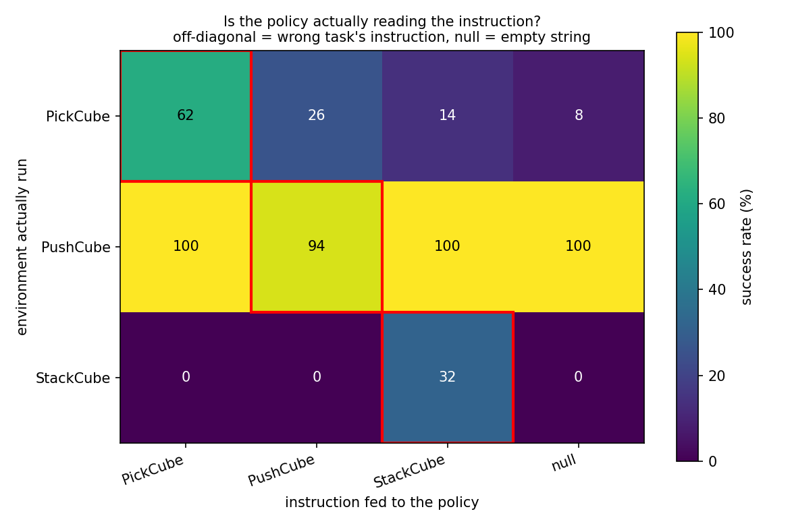
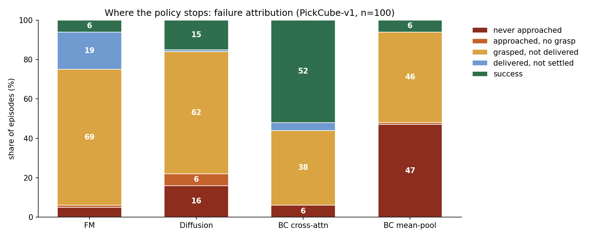
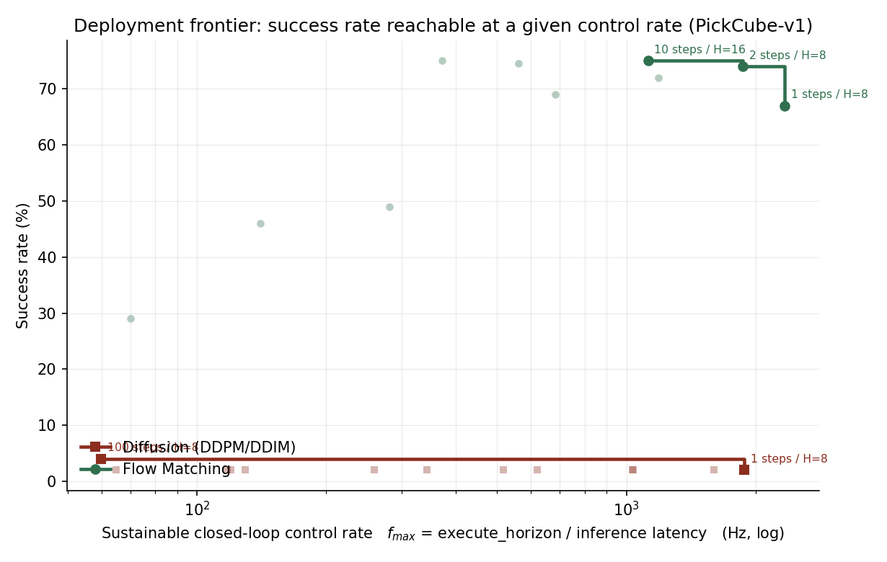

# Flow Matching Policies for Robot Manipulation：生成式动作头什么时候值得用

语言 / Language: **中文** · [English](#english)

在 ManiSkill3 上训练语言条件的多任务机械臂操作策略，用 Flow Matching 生成动作块，
对照组是**同编码器、同骨干、同参数量、同训练预算、同观测配置**的 Diffusion Policy
和行为克隆。

项目要回答的不是"哪个模型成功率高"，而是：

> **给定一批演示数据，生成式动作头（Flow Matching / Diffusion）值不值得用？
> 这件事能不能在训练之前就判断出来？**

这个问法是被数据逼出来的。选生成式动作头的标准理由是"同一个观测对应多种合法动作，
MSE 回归会塌到条件均值，而均值可能本身就非法"。**这个理由在一份具体的数据上成不成立，
是可以量的，而且只要几分钟。**量完之后本项目的结论是：

- ManiSkill 的运动规划演示，条件动作分布是**宽的单峰**（双峰系数 0.49，正态参考 0.555）。
  没有多模态可表示，于是同骨干的回归基线在多任务上反而更强。
- 单任务下容量宽裕，Flow Matching 仍然领先（74% vs 52%）；
  任务数增加到三个、容量被摊薄之后，建模整个条件分布的代价压倒了它的表达优势。
- 把 Flow Matching 加宽到 2.2 倍容量，**训练 loss 更低，成功率反而崩掉**
  （0.1147 → 0.1134，60/96/36 → 4/95/8）。更好的生成模型给的是更好的**样本**，
  而单峰数据上你要的是均值。

这三条合起来是一个可操作的判据，不是一句"看情况"。

## 三条训练前判据（几分钟，各挡掉一整轮训练）

这是这个仓库最值钱的部分。三条都来自实际烧掉的训练，现在固化成脚本。

| 判据 | 问题 | 脚本 | 实测 |
|---|---|---|---|
| **动作表示信噪比** | 动作里有多少是任务信息，多少只是"手臂当前在哪" | 已接进 `src/train.py`，每次训练自动跑 | `pd_joint_pos` 任务信号 1.6% → 成功率锁死 4%；换 `pd_ee_delta_pose` 后 57–74% |
| **观测充分性** | 任务里的关键物理量，能不能从策略看到的观测里恢复 | `scripts/probe_observability.py` | PickCube 的目标 R²≈0（不可见），接进 proprio 后 6% → 75% |
| **条件分布的模态数** | 演示的条件动作分布是多模态还是宽的单峰 | `scripts/conditional_spread.py` | 三个任务双峰系数 0.49/0.39/0.48，全部单峰 → 生成式动作头没有多模态可表示 |

第三条是本轮新增的，它直接决定要不要用生成式动作头。

## 结果

### 单任务受控对比（PickCube，100 episode，在线权重）

同编码器、同 6.80M 可训练参数、同 20000 步、同样接入目标位置：

| 方法 | 采样步数 | 成功率 |
|---|---|---|
| **Flow Matching** | 10 | **74%** |
| BC · cross-attention 读出 | 1 次前向 | 52% |
| Diffusion Policy | 100 | 33% |
| BC · 平均池化读出 | 1 次前向 | 3% |

**这张表里有两个数字是这轮修出来的，它们改变了结论。**

*BC 的读出方式。* 原来的 BC 把 83 个 context token 平均池化再过 MLP，
`goal_pos` 只占 1 个 token，被稀释成 1/83；而 FM 走 cross-attention 可以定向读它。
于是"FM 75% vs BC 4%"这个差距同时改了两件事。换成与 FM 逐层同构的读出
（同一个 `FMDenoiser` 骨干、同样的 cross-attention，只是没有噪声输入、没有流时间，
一次前向直接回归动作块，参数量只多一个 query 的 112 个）之后，BC 是 52%。
**71 个百分点里有 49 个是读出方式，只有 23 个是建模方式。**

*DDPM 基线曾经是死的。* 指纹是所有配置精确相等：采样步数 1→50、执行长度 1→16
全是 2.0%，平均步长恒为 294.1。根因是 cosine 调度的 `alphas_cumprod` 末项被压到
2.4e-7，而 DDIM 恰好从这一项起步，`1/√ᾱ ≈ 2029` 把噪声预测的误差放大两千倍。
裁剪 `x0_pred` 到 ±4 之后曲线才正常：

| DDPM 采样步数 | 1 | 2 | 4 | 8 | 16 | 50 | 100 |
|---|---|---|---|---|---|---|---|
| 成功率 | 2% | 2% | 3% | 10% | 25% | 33% | 33% |

FM 一步 67%、两步 74%。**这个差距是修好基线之后测出来的，不是基线坏掉的产物。**

### 多任务：三个任务，一个观测空间

任务集是 **PickCube + PushCube + StackCube**。三个任务的目标来源各不相同：

| 任务 | 目标是什么 | 相机里可见吗（探针 R²） | 取自 |
|---|---|---|---|
| PickCube | 每局随机的半透明标记 | **否**（−0.05/+0.07/+0.09） | `goal_site` |
| PushCube | 画在桌面上的目标区域 | 是（+0.99/+0.98/+1.00） | `goal_region` |
| StackCube | 下面那块方块 | 部分（+0.59/+0.51/−0.04） | `cubeB` |

PushCube 那一行是探针的一次**预测检验**：ManiSkill 在视觉观测模式下故意不给
PushCube 的 `goal_pos`，因为设计者认为它应该被看见。同一个探针、同样的留出集协议，
在一个它没见过的任务上独立证实了这一点。

100 episode，60000 步（每个任务分到的梯度步数与单任务的 20000 步相当）：

| 方法 | 采样步数 | PickCube | PushCube | StackCube |
|---|---|---|---|---|
| BC · cross-attention | 1 次前向 | **90%** | 94% | **48%** |
| Flow Matching | 10 | 60% | **96%** | 36% |
| Diffusion Policy | 100 | 44% | 92% | 3% |

Flow Matching 稳赢 Diffusion，且只用十分之一的采样步数；但输给同条件的回归基线。
**这个方向与单任务相反**，下一节解释为什么。

作为对照，这个仓库先前的多任务数字是 3/3/0%，当时把根因写成"统一观测空间与提供
显式目标不可兼得"的架构冲突。冲突不存在：冲突只在目标**从哪来**，不在目标**是什么**。
三个任务的目标都是一个 3 维世界坐标"物体最终该到哪"，来源按任务定义即可。

### 为什么 Flow Matching 在多任务上输了

依次排除，每一步都有数字。

**不是 CFG dropout 的不对称。** FM 和 DDPM 训练时有 20% 的样本指令被替换成空串
（为了兼学无条件速度场），BC 没有；而评测一律 `guidance=1.0`，根本不走 CFG。
设成 0 之后 FM 从 63/90/7 变成 60/96/36 —— 有影响，不足以翻盘。

**不是采样步数不够。** 2/4/10/20 步的 PickCube 成功率是 66/65/60/66%，曲线是平的。

**不是过度发散。** 数据的条件散度 0.40，模型的采样散度 0.325，校准良好。

**不是采样噪声。** 采 K 个样本取均值（蒙特卡洛估计条件均值），
K=1/4/16 → 60/56/53%，**不但没帮助还单调变差**。变差本身有信息：
平均会把动作块里时序位置不同的事件抹平（夹爪闭合在第 5 步还是第 7 步），
产生一个任何单样本都不会给出的非法动作块。

**是学到的函数本身更差。** 开环的动作复现误差（归一化动作单位，边缘按定义为 1）：

| 方法 | 动作 RMSE | 夹爪落在中间带 |
|---|---|---|
| FM 单样本 | 0.284 | 0.0% |
| FM 16 样本均值 | 0.229 | 3.0% |
| **BC · cross-attention** | **0.154** | 1.5% |
| 真实演示（参照） | — | 0.0% |

FM 用 16 个样本估出的条件均值，误差仍是 BC 的 1.5 倍。而夹爪那一列说明
FM 的样本**结构上是干净的** —— 它没有病，就是估得不够准。

**加容量让它更差。** 把 FM 从 6.80M 加宽到 15.01M：

| | 训练 loss | PickCube | PushCube | StackCube |
|---|---|---|---|---|
| FM 6.80M | 0.1147 | 60% | 96% | 36% |
| FM 15.01M | **0.1134** | **4%** | 95% | **8%** |

loss 更低、策略更差，而且不是没训好（loss 曲线正常下降）。这与前面的诊断一致：
容量更大 → 条件分布拟合得更忠实 → 采样更忠实地复现演示噪声 → 控制更差。
**单峰数据上你要的是均值，而更好的生成模型给你的是更好的样本。**

一句话收束：

> 同等容量与预算下，建模整个条件分布的代价是**条件均值本身估得更差**。
> 单任务时容量宽裕，这个代价付得起；三个任务摊薄容量之后，代价压倒了表达优势。
> 而这份数据的条件分布是单峰的，那份多出来的建模能力换不回任何东西。

### 语言到底有没有被用上

多任务跑通不等于"语言条件"成立。评测时把指令换掉，看成功率掉多少
（`scripts/language_ablation.py`，不需要重训，行 = 实际环境，列 = 喂进去的指令）：

| 环境 \ 指令 | PickCube | PushCube | StackCube | null |
|---|---|---|---|---|
| PickCube | **62%** | 26% | 14% | 8% |
| PushCube | 100% | **94%** | 100% | 100% |
| StackCube | 0% | 0% | **32%** | 0% |



StackCube 上换成别的任务的指令直接掉到 0%，PickCube 从 62% 掉到 8–26%
—— **语言是真的在承重**。而 PushCube 无论喂什么指令都是 94–100%。

这与上面的探针结果互相印证：**目标在相机里可见的任务，语言是冗余的；
目标不可见的任务，语言是唯一的出路。** 两个独立测量指向同一件事。

### 失败归因：卡在动作链条的哪一段

PickCube 的链条是 接近 → 抓取 → 送达 → 静止。环境自己就把后三段暴露成
`is_grasped` / `is_obj_placed` / `is_robot_static`，所以分段判定用的是任务的
成功判据本身拆开，不是自定阈值。



一个成功率数字说不出"没学会看"和"学会了但停不稳"的区别，而这两者的下一步完全不同。

### 部署可行域：成功率 vs 可达控制频率（支撑结果）

控制回路跑 f Hz、一次推理执行 H 步，就必须在 H/f 秒内算完下一块，
所以可持续的最高控制频率是 `f_max = execute_horizon / 推理延迟`。
这个式子假设推理与执行是流水的；同步实现达到的频率比这个上界低。



这条线在主张重锚之后降级为支撑结果：它比较的是 FM 与 Diffusion 的少步区行为，
而本项目更重要的结论在上面几节。

## 核心思路

一句话：**把"预测下一段动作"建模成从噪声到动作块的一次流动，而不是一次回归**，
并且**量清楚这件事在什么条件下划算**。

- **Flow Matching 相对 Diffusion 的优势是稳的。** FM 回归的条件速度场是**常数**
  `x₁ − x₀`，条件路径为直线，因此少步 Euler 积分即可采样。实测 FM 两步 74%，
  而同骨干同参数量的 DDPM 要 50 步才到 33%。
- **Flow Matching 相对确定性回归的优势是有条件的。** 标准论证是"演示里同一个观测
  可能对应多种合法动作，MSE 回归的最优解是条件均值，而均值可能本身就非法"。
  这个论证依赖的**不是散度大，而是多模态** —— 散度区分不了"几个模态"和
  "一个宽的单峰"。本项目把两者分开量了（`scripts/conditional_spread.py`）：

  | PickCube 演示数据 | 条件散度 | 双峰系数（正态 0.555） | 判定 |
  |---|---|---|---|
  | 仅运动规划 | 0.42 | 0.494 | 单峰 |
  | 仅 RL（PPO） | 0.12 | 0.244 | 单峰 |
  | 两者混合（平衡近邻，动作已裁到 [−1,1]） | 1.05 | 0.547 | 宽的平顶单峰 |

  三个任务（PickCube / PushCube / StackCube）的双峰系数是 0.49 / 0.39 / 0.48，
  全部低于正态参考值。**前提不成立**，所以同条件的回归基线在多任务上更强。
  这不是实现问题，是数据的性质。

  还有一条独立证据：BC 输出的就是条件均值，它拿到 90%。若分布真是双峰的，
  均值会落在两个模态之间，BC 应该失败才对。

- **基线的可比性**：FM / DDPM / BC 三者共用同一个编码器；FM、DDPM 与
  `BCXAttnPolicy` 的 denoiser 结构与参数量完全相同（6.80M，BC 多一个 query 的
  112 个参数）；训练预算、观测配置、评测协议一致。
  `BCPolicy`（平均池化 + MLP）保留为"读出方式做错了会怎样"的反面对照。

理论推导（含 CFM 梯度等价性证明）见 [docs/flow_matching.md](docs/flow_matching.md)。

## 架构

```
RGB (2帧, 126×126)  ──► DINOv2-S (冻结) ──► 81 个 patch token ─┐
语言指令             ──► SigLIP 文本塔(冻结) ──► 1 个 token ────┼─► context (B, 83, 256)
本体状态 (12 维:关节角+目标) ──► MLP ──────► 1 个 token ────┘         │
                                                                      │ cross-attn
噪声动作块 x_t (16×7) ──► Transformer denoiser (AdaLN 注入流时间 t) ◄──┘
                                    │
                                    ▼
                         速度场 v_θ ──► Euler 积分 ──► 动作块
```

- 视觉/语言骨干全部冻结（**99.5% 参数冻结**）：演示只有 1000 条/任务，微调 ViT 必然过拟合
- denoiser 用 DiT 式设计：AdaLN 注入流时间，残差分支与输出层**零初始化**，起步即恒等映射
- checkpoint 同时保存在线权重与 EMA 权重，用哪套由实测决定而非默认（见下）
- CFG 的有条件/无条件两路拼成一个 batch，一次前向完成

### 观测规格（读结果前必须先看这个）

本体状态 9 维是关节角 + 夹爪，再拼上 3 维目标位置，共 12 维。
**目标位置按任务取自不同的 actor**（`src/data/dataset.TASK_GOAL_ACTOR`）：
PickCube 取相机里不可见的目标标记，PushCube 取桌面上的目标区域，
StackCube 取下面那块方块。语义统一成一句话：**物体最终该到哪**。

这一步是多任务成立的全部关键。先前试过"目标槽 + 有效位"（13 维，没有目标的任务
填零并置 valid=0）：观测空间是统一了，但三个任务里有两个的目标槽恒为零，
proprio 编码器学会了不看它，多任务 PickCube 退回"抓取率 90% / 成功率 6%" ——
与单任务完全不给目标时的 6% 一模一样。

同一个 PickCube，接不接目标是 6% 和 75%。**任何一个成功率数字都必须和观测配置
一起读**，所以 `use_goal` / `goal_slot` / `n_average` 都是 `outputs/*.csv` 的一等列，
并有回归测试钉住。

## Quick Start

```bash
conda create -n robot python=3.10 -y && conda activate robot
pip install -r requirements.txt

# 混合显卡笔记本上装驱动会让 Xorg 选错显卡导致开机黑屏，见 docs/gpu-setup.md
sudo bash scripts/setup_gpu.sh

# 1) 下载并重放演示数据（官方 demo 的 obs/ 是空的，必须重放渲染才有图像）
bash scripts/download_demos.sh
bash scripts/replay_demos.sh

# 2) 三条训练前判据 —— 先跑这三个，再决定训不训
python scripts/probe_observability.py --task PickCube-v1     # 目标在观测里吗
python scripts/conditional_spread.py --task PickCube-v1 --k 16   # 条件分布是不是多模态
#    动作表示信噪比已接进 src/train.py，每次训练自动跑

# 3) 冻结特征缓存（可选但强烈建议）
#    视觉骨干全冻结且管线里没有图像增强，所以预先算好 patch token 是数值等价的
#    （与像素路径的相对误差 2.2e-4，小于训练用的 bf16 精度）。
#    训练从 8.3 it/s 提到 25–36 it/s，单轮 20000 步从 40 分钟降到 10 分钟。
python scripts/build_feature_cache.py --tasks PickCube-v1 PushCube-v1 StackCube-v1
CACHE=~/.maniskill/feat_cache

# 4) 训练（受控对比：三者观测配置、训练预算、参数量完全一致）
MT='[PickCube-v1,PushCube-v1,StackCube-v1]'
python -m src.train tasks=$MT ++task_goal=true ++steps=60000 ++feature_cache=$CACHE
python -m src.train tasks=$MT ++task_goal=true ++steps=60000 ++feature_cache=$CACHE model=ddpm
python -m src.train tasks=$MT ++task_goal=true ++steps=60000 ++feature_cache=$CACHE model=bc_xattn

# 5) 评测与消融（复用 checkpoint，无需重训）
#    --no-ema 不是笔误，见下方"EMA 在这个项目里是坏的"
python scripts/run_eval.py --ckpt <ckpt> --n-episodes 100 --no-ema
python scripts/run_eval.py --ckpt <ckpt> --no-ema --sweep-steps 1 2 4 8 16
python scripts/run_eval.py --ckpt <ckpt> --no-ema --n-average 16   # 取均值而非抽样本

# 6) 分析与出图
python scripts/language_ablation.py --ckpt <多任务 ckpt> --n-episodes 50
python scripts/action_accuracy.py --ckpt <fm> <bc> --task PickCube-v1
python scripts/failure_modes.py --ckpt <fm> <ddpm> <bcx> --labels FM Diffusion "BC cross-attn"
python scripts/action_diversity.py --fm <fm> --bc <bcx>
python scripts/latent_action_probe.py --task PickCube-v1     # latent 动作空间值不值得试
python scripts/make_report.py --weights online --write-readme

# 长实验用串行队列跑：阶段级 .done 断点续跑，setsid 脱离终端，systemd-inhibit 挡休眠
RUN_DIR=outputs/$(date +%F) setsid nohup env QUEUE_PLAN=scripts/queue_plan_main.sh \
    systemd-inhibit --what=idle:sleep:handle-lid-switch bash scripts/queue.sh &
```

## 工程记录

开发过程中发现的、与常见教程/计划不符的地方，都在代码和笔记里留了记录。
排查的完整过程见 [docs/debugging.md](docs/debugging.md)。

| 发现 | 说明 |
|---|---|
| **动作表示决定成败** | `pd_joint_pos` 下 98.4% 的动作方差只由"手臂当前在哪"决定，任务信号仅 1.6%，成功率锁死在 4%。换 `pd_ee_delta_pose` 后任务信号 57–74%，策略才学会接近与抓取 |
| **目标不在观测里** | 抓取率 95% 但成功率 6%。线性探针显示目标在 `base_camera` 里的 R² ≈ 0，接进 proprio 后 6% → 75%。"高抓取率 + 低成功率"是观测缺失的典型指纹 |
| **基线的读出方式能吃掉 49 个百分点** | BC 平均池化 83 个 token，目标被稀释成 1/83；FM 走 cross-attention。换成同构读出后 BC 从 3% 到 52%。一个大到需要解释的差距，先怀疑对比本身 |
| **所有配置精确相等 = 实现坏了** | 这个指纹在本项目出现过三次，没有一次是建模问题。最后一次是 DDPM 的 cosine 调度末项 `ᾱ≈2.4e-7` 把噪声预测误差放大两千倍，裁剪 `x0_pred` 即解 |
| **FM 的 loss 与成功率可以反向移动** | 把 FM 加宽到 2.2 倍容量，loss 从 0.1147 降到 0.1134，成功率从 60/96/36 崩到 4/95/8。更好的生成模型给的是更好的**样本**，而单峰数据上你要的是均值 |
| **散度大 ≠ 多模态** | 选生成模型的论证依赖多模态，而散度区分不了"几个模态"和"一个宽的单峰"。必须做双峰检验，不能只看散度 |
| **取均值会抹平相位** | 对 FM 采样取平均，开环误差降了（0.284→0.229）成功率却掉了（60%→53%）。夹爪闭合在第 5 步还是第 7 步，平均后成了悬在中间的值 —— 动作块的集合不是凸的 |
| **演示里记的是裁剪前的动作** | PPO 的演示有 17.9% 的元素越出 [−1,1]（夹爪最大 ±4.85），而环境执行前会裁。不裁就混不了两种来源：合并归一化后运动规划的动作被压到 0.06 的尺度，FM 和 BC 双双掉到 3% |
| **EMA 在这个项目里是坏的** | `decay=0.9999` 的时间常数 10000 步，对 20000 步的训练太慢。同一批 checkpoint：在线权重 6/37/59/70/75%，EMA 读数却是平的 8/4/4/4/4% |
| **成功率在低分区间读不出趋势** | 25 个 episode 下 8% 和 4% 只差一次成功。用 TCP→目标距离、抓取率这类连续量判断，10 个 episode 即可定论（`scripts/diagnose_rollout.py`） |
| **推理配置必须进结果表的 schema** | `use_goal` / `goal_slot` / `n_average` 任一漏记，汇总脚本就会把不同实验平均成一个不对应任何实验的数字，而且不报错。踩过两次 |
| **冻结骨干的特征可以缓存** | 骨干全冻结且没有图像增强，所以预算 patch token 是数值等价的（相对误差 2.2e-4）。训练快 3–4 倍，多 seed 和消融矩阵才变得可做 |
| **队列编排别用 pgrep 匹配命令行** | `pgrep -f "bash scripts/queue.sh"` 会匹配到命令行里含这个字符串的任何进程，包括刚敲下的那条命令本身。后继队列因此静默等了十分钟，改用 pidfile |
| DINOv2 输入不能是 96×96 | patch 是 14×14，96 除不尽。改用 126×126 → 81 个 patch |
| 动作维度随控制模式变 | `pd_joint_pos` 是 8 维，`pd_ee_delta_pose` 是 7 维 |
| 官方 demo 的 `obs/` 是空的 | 采集时 `obs_mode="none"`，必须重放渲染才有图像观测 |
| BF16 不需要 GradScaler | GradScaler 是给 FP16 防梯度下溢的；BF16 指数位与 FP32 相同 |
| FM 与 DDPM 的 loss 不可比 | 目标不同、方差下界不同。实测 DDPM 收敛在 0.05、FM 在 0.18，但这不表示 DDPM 学得更好 |
| TF32 默认是关的 | torch 2.x 里 matmul 的 TF32 默认关闭，打开实测有 1.3–2.9x 加速 |
| checkpoint 曾达 1.1GB | 冻结骨干被存了两份；只存可训练参数后降到 52MB |

## 已知局限

诚实起见，这些都是**没做**而不是"不重要"。

- **没有留出验证集。** 所有 episode 都进了训练，所以开环的动作复现误差报的是
  **训练集拟合误差**，不是泛化误差。用于方法之间的比较是成立的（数据访问完全相同），
  但不能当作泛化能力的证据。这是最该先补的一条。
- **主要结论只有 1–2 个 seed。** 成功率的测量噪声实测约 3 个百分点，
  小于这个尺度的差距不成立（例如多任务 PushCube 上 FM 96% 与 BC 94% 不算差距）。
  有了特征缓存之后一轮只要 10 分钟，多 seed 是现实的，只是还没跑。
- **单任务与多任务的结论方向相反，机制只有诊断没有直接验证。** 诊断是
  "容量被三个任务摊薄后，建模整个条件分布的代价压倒表达优势"，
  支撑证据是加容量反而更差、开环误差大 1.5 倍、取均值无效。
  但"容量"这个变量没有被单独扫过一条曲线。
- **没有造出干净的多模态数据。** 混合运动规划与 PPO 两种解法后，条件散度到 1.05
  但双峰系数只有 0.547（正态参考 0.555），是很宽的平顶单峰而非双峰。
  也就是说"生成式动作头在多模态数据上更强"这条推论，本项目**没有**在实验上证实，
  只证实了它的前提在单峰数据上不成立。要证实它需要真正多模态的演示
  （例如人类遥操作，ManiSkill 只提供 10 条，不够训练）。
- **少步扩散基线用的是 DDIM + cosine 调度**，不是 DPM-Solver++ 之类的高阶求解器。
  DDPM 在少步区被低估的可能性存在，读 FM vs Diffusion 的差距时要打折。
- **OT-CFM 在多任务上是负结果且未追究。** batch 内最优指派 + logit-normal 时间采样
  实测 2/96/0%。怀疑是混合任务的 batch 里最优指派让 x₀ 携带了任务信息，
  而推理时 x₀ 是随机的，但没有单独拆开验证。
- **latent 动作空间只做了判据，没有实现。** 自编码器重建 RMSE 0.039（BC 的开环误差
  是 0.154），头顶空间足够；但 latent 空间里平均两个动作块，夹爪落在中间带的比例
  仍有 47.5%（原始空间 49.5%，真实演示 0.0%），朴素自编码器修不好凸性。
- **只用 `base_camera`。** StackCube 的演示里还有腕部相机，PickCube 可以用
  `robot_uids=panda_wristcam` 重放出来，但没有做，统一观测空间的代价是丢掉了它。
- **PegInsertionSide 被移出任务集。** 0%，需要毫米级插入且缺腕部相机，
  撑不起任何结论。这是"任务撑不起结论就换任务"，不是"这个任务不重要"。
- **架构仍然是 VLA 的形状而非 VLA。** DINOv2 与 SigLIP 文本塔是两个独立预训练的
  骨干，只在 token 层面拼接，两个模态没有在骨干内部对齐。换成单个视觉语言骨干
  （PaliGemma 一类）是明确的下一步，8GB 显存下要靠特征缓存才可行。

## 目录结构

```
fm_policy/
├── configs/          # Hydra：train.yaml + model/{bc,bc_xattn,fm,ddpm} + task/*
├── src/
│   ├── models/
│   │   ├── encoders.py   # VisualEncoder / LanguageEncoder / ProprioEncoder
│   │   │                 #   VisualEncoder 按维数分派像素或缓存特征
│   │   ├── denoiser.py   # SinusoidalPosEmb / AdaLN / CrossAttention / FMDenoiser
│   │   └── policy.py     # FMPolicy / DDPMPolicy / BCXAttnPolicy / BCPolicy
│   │                     #   + ot_couple / sample_flow_time / EMA / ActionNormalizer
│   ├── data/dataset.py   # ManiskillDataset / MixedSourceDataset + 训练评测共用的预处理
│   ├── diagnostics.py    # 训练前检查：动作表示信噪比、线性探针
│   ├── train.py          # Hydra 训练入口，含 last.pt 断点续跑
│   └── evaluate.py       # rollout、成功率、obs_kwargs（观测配置的唯一出口）
├── scripts/
│   ├── 训练前判据
│   │   ├── probe_observability.py   # 这个物理量在观测里吗
│   │   ├── conditional_spread.py    # 条件动作分布是多模态还是宽的单峰
│   │   └── latent_action_probe.py   # latent 动作空间值不值得试
│   ├── 评测与消融
│   │   ├── run_eval.py              # 采样步数 / 执行长度 / CFG / 取均值
│   │   ├── language_ablation.py     # 换掉指令，看语言有没有被用上
│   │   ├── action_accuracy.py       # 开环动作复现误差，把建模误差剥出来
│   │   ├── action_diversity.py      # 模型的采样散度
│   │   ├── failure_modes.py         # 卡在动作链条哪一段
│   │   └── diagnose_rollout.py      # 低分区间用的连续指标
│   ├── 基础设施
│   │   ├── build_feature_cache.py   # 冻结 patch token 预计算（数值等价）
│   │   ├── queue.sh + queue_plan_main.sh  # 串行队列，阶段级 .done 断点续跑
│   │   └── wait_then_run.sh         # 队列串联（pidfile 判据，不用 pgrep）
│   └── pareto.py / make_report.py / benchmark_inference.py
├── notebooks/        # 逐步验证实验（玩具 FM、编码器选型、多模态论证）
├── docs/             # 推导 / 排查记录 / 进度 / GPU 配置
└── tests/            # pytest 31 个
```

## English

A language-conditioned manipulation policy trained with Flow Matching on ManiSkill3,
compared against Diffusion Policy and behaviour-cloning baselines that share the
**same encoder, same denoiser, same parameter count, same training budget, and same
observation configuration**.

The question is not "which model scores highest" but:

> **Given a set of demonstrations, is a generative action head worth using, and can
> that be decided before training?**

The standard argument for a generative action head is that the same observation admits
several valid actions, so MSE regression collapses to a conditional mean that may
itself be invalid. **Whether that holds on a given dataset is measurable, and it takes
minutes.** Measured here, it does not hold: on ManiSkill's motion-planning
demonstrations the conditional action distribution is a *wide unimodal* one
(bimodality coefficient 0.49 against a normal reference of 0.555), so a
matched-capacity regression baseline with the same cross-attention readout wins in the
multi-task setting.

**Headline numbers.** Single task (PickCube, 100 episodes, identical conditions):
Flow Matching 74%, BC with cross-attention readout 52%, Diffusion Policy 33%, BC with
mean-pool readout 3%. Multi-task (PickCube + PushCube + StackCube, 60k steps): BC
90/94/48, Flow Matching 60/96/36, Diffusion 44/92/3. Flow Matching beats Diffusion
everywhere and does so with a tenth of the sampling steps; it loses to the regression
baseline once capacity is shared across three tasks.

**Three findings that changed the conclusion.** (1) The previously reported "FM 75% vs
BC 4%" was 49 points readout architecture and 23 points modelling choice: the old BC
mean-pooled 83 context tokens, diluting the goal to 1/83. (2) The Diffusion baseline
was dead, pinned at exactly 2.0% across every configuration, because a cosine schedule
leaves `alphas_cumprod[-1] ≈ 2.4e-7` and DDIM starts there, amplifying the noise
prediction error by ~2000x. (3) Widening Flow Matching from 6.80M to 15.01M parameters
*lowered* the training loss (0.1147 → 0.1134) and *collapsed* the success rate
(60/96/36 → 4/95/8): a better generative model returns a better *sample*, and on
unimodal data what you want is the mean.

**The most useful part of the repository is the three pre-training checks**, each
distilled from a wasted training run: action-representation signal-to-noise,
observability of the task-relevant quantities under a held-out ridge probe, and the
modality of the conditional action distribution. Each takes minutes and each can veto
a training run. See [docs/debugging.md](docs/debugging.md) for how each was found.

Known limitations are listed above (中文) and are not small: no held-out split, one or
two seeds, and no dataset with genuine multimodality, which means the converse claim
("generative heads win when the data is multimodal") is **not** demonstrated here.
